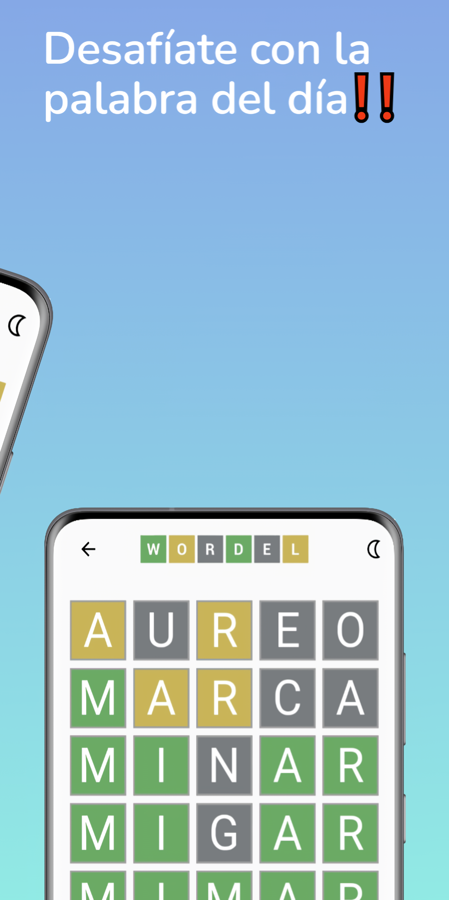
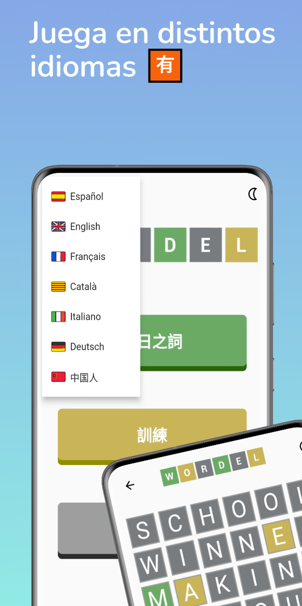
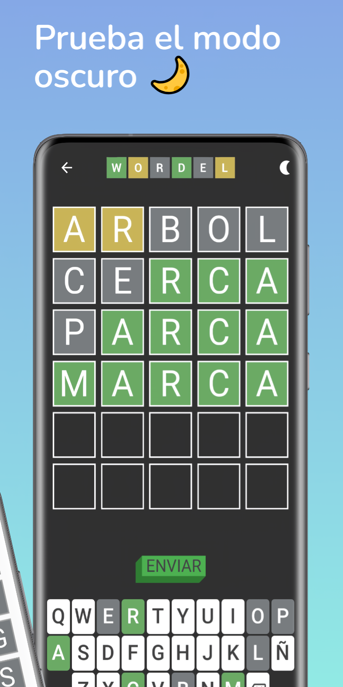
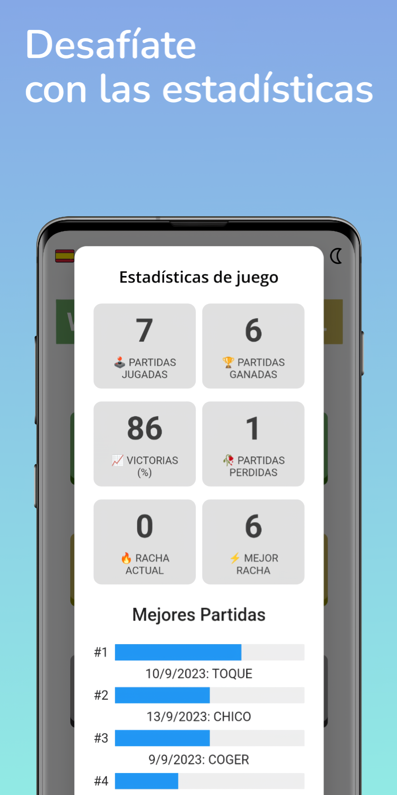
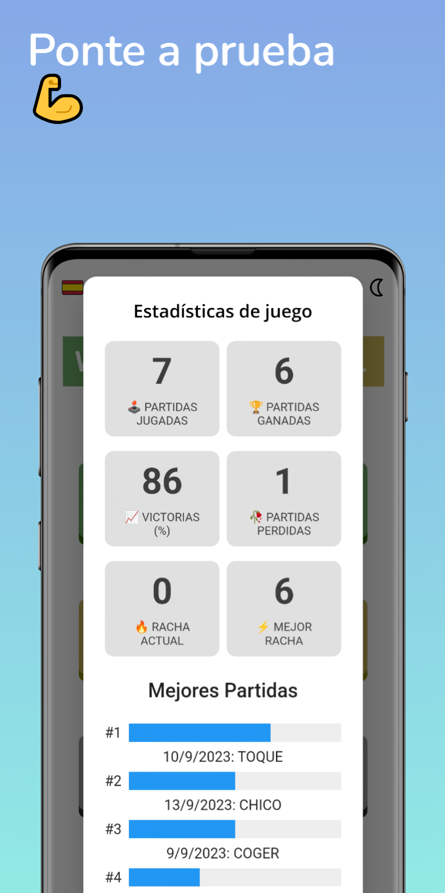

[Español](#wordel---aplicación-en-flutter)

# WORDEL - Flutter App


WORDEL is a mobile application built with Flutter, inspired by the famous word game "Wordle." Players must guess a random word with limited attempts and through a series of clues.

It is a mobile-oriented application where players can engage through a simple and intuitive interface.

Download by clicking on the following image:
[](https://github.com/jcmh05/wordleDSDM/raw/main/wordle.apk)

## 📸 Screenshots

<div style="display: flex; justify-content: space-between;">
    
    
    
</div>

<div style="display: flex; justify-content: space-between; margin-top: 20px;">
    
    
    
</div>


## 📌 Features

- Over 6 different languages, including their respective dictionaries and keyboards.
- Option to choose words of 4, 5, or 6 letters.
- Game statistics and a leaderboard of top players.
- Settings to customize the gaming experience.
- Word of the Day mode: every day there will be a new word to guess, and it will be the same for all players who have the application installed.
- Training mode for unlimited gameplay.

## 🛠️ Operation

For each day, a random word will be chosen from the dictionary of the selected language. This word will be based on the date, ensuring it is the same for all player:
```dart
_words = await loadWords(wordLength);
String dateString = now.day.toString() + now.month.toString() + now.year.toString();
int index = dateString.hashCode % (_words.length-1);
_selectedWord = entrenamiento ? _words[Random().nextInt(_words.length-1)] : _words[index];
```

Main function to determine the color of the letters:
```dart
int devolverColor(String palabra, String palabraIntroducida, int posicion) {
  List<bool> verdes = List<bool>.filled(palabra.length, false);
  List<bool> amarillas = List<bool>.filled(palabra.length, false);
  Map<String, int> letraFrecuencia = {};

  // Calcular la frecuencia de las letras en la palabra
  for (int i = 0; i < palabra.length; i++) {
    if (letraFrecuencia.containsKey(palabra[i])) {
      letraFrecuencia[palabra[i]] = letraFrecuencia[palabra[i]]! + 1;
    } else {
      letraFrecuencia[palabra[i]] = 1;
    }
  }

  // Encontrar letras verdes
  for (int i = 0; i < palabra.length; i++) {
    if (palabra[i] == palabraIntroducida[i]) {
      verdes[i] = true;
      letraFrecuencia[palabra[i]] = letraFrecuencia[palabra[i]]! - 1;
    }
  }

  // Encontrar letras amarillas
  for (int i = 0; i < palabra.length; i++) {
    if (!verdes[i] &&
        letraFrecuencia.containsKey(palabraIntroducida[i]) &&
        letraFrecuencia[palabraIntroducida[i]]! > 0) {
      amarillas[i] = true;
      letraFrecuencia[palabraIntroducida[i]] =
          letraFrecuencia[palabraIntroducida[i]]! - 1;
    }
  }

  // Determinar el color correcto
  if (verdes[posicion]) {
    return 3; // Color verde
  } else if (amarillas[posicion]) {
    return 2; // Color amarillo
  } else {
    return 1; // Color gris
  }
}
```


# WORDEL - Aplicación en Flutter


WORDEL es una aplicación móvil realizada en Flutter inspirada en el famoso juego de palabras "Wordle". Los jugadores deben adivinar una palabra al azar con conjeturas limitadas ya través de una serie de pistas.

Es una aplicación orientada a dispositivos móviles donde los jugadores pueden jugar mediante una interfaz sencilla e intuitiva.

Descargar haciendo click sobre la siguiente imagen:
[](https://github.com/jcmh05/wordleDSDM/raw/main/wordle.apk)

## 📸 Capturas

<div style="display: flex; justify-content: space-between;">
    
    
    
</div>

<div style="display: flex; justify-content: space-between; margin-top: 20px;">
    
    
    
</div>


## 📌 Características

  - Más de 6 idiomas diferentes, incluyendo sus diferentes diccionarios y teclados
  - Posibilidad de elegir palabras de 4, 5 o 6 letras
  - Estadísticas de juego y un top de los mejores juegos
  - Ajustes para personalizar la experiencia de juego
  - El modo Palabra Del Día dónde cada día habrá una palabra nueva a adivinar, esta será la misma palabra para todos los jugadores que tengan instalada la aplicación
  - Un modo entrenamiento para jugar de forma ilimitada
  
## 🛠️ Funcionamiento

Para cada día se escogerá una palabra aleatoria del diccionario del idioma que tengamos seleccionado, esta palabra se basará en la fecha, por lo que será igual para todos los jugadores:
```dart
_words = await loadWords(wordLength);
String dateString = now.day.toString() + now.month.toString() + now.year.toString();
int index = dateString.hashCode % (_words.length-1);
_selectedWord = entrenamiento ? _words[Random().nextInt(_words.length-1)] : _words[index];
```

Función principal para resolver el color de las letras
```dart
int devolverColor(String palabra, String palabraIntroducida, int posicion) {
  List<bool> verdes = List<bool>.filled(palabra.length, false);
  List<bool> amarillas = List<bool>.filled(palabra.length, false);
  Map<String, int> letraFrecuencia = {};

  // Calcular la frecuencia de las letras en la palabra
  for (int i = 0; i < palabra.length; i++) {
    if (letraFrecuencia.containsKey(palabra[i])) {
      letraFrecuencia[palabra[i]] = letraFrecuencia[palabra[i]]! + 1;
    } else {
      letraFrecuencia[palabra[i]] = 1;
    }
  }

  // Encontrar letras verdes
  for (int i = 0; i < palabra.length; i++) {
    if (palabra[i] == palabraIntroducida[i]) {
      verdes[i] = true;
      letraFrecuencia[palabra[i]] = letraFrecuencia[palabra[i]]! - 1;
    }
  }

  // Encontrar letras amarillas
  for (int i = 0; i < palabra.length; i++) {
    if (!verdes[i] &&
        letraFrecuencia.containsKey(palabraIntroducida[i]) &&
        letraFrecuencia[palabraIntroducida[i]]! > 0) {
      amarillas[i] = true;
      letraFrecuencia[palabraIntroducida[i]] =
          letraFrecuencia[palabraIntroducida[i]]! - 1;
    }
  }

  // Determinar el color correcto
  if (verdes[posicion]) {
    return 3; // Color verde
  } else if (amarillas[posicion]) {
    return 2; // Color amarillo
  } else {
    return 1; // Color gris
  }
}
```